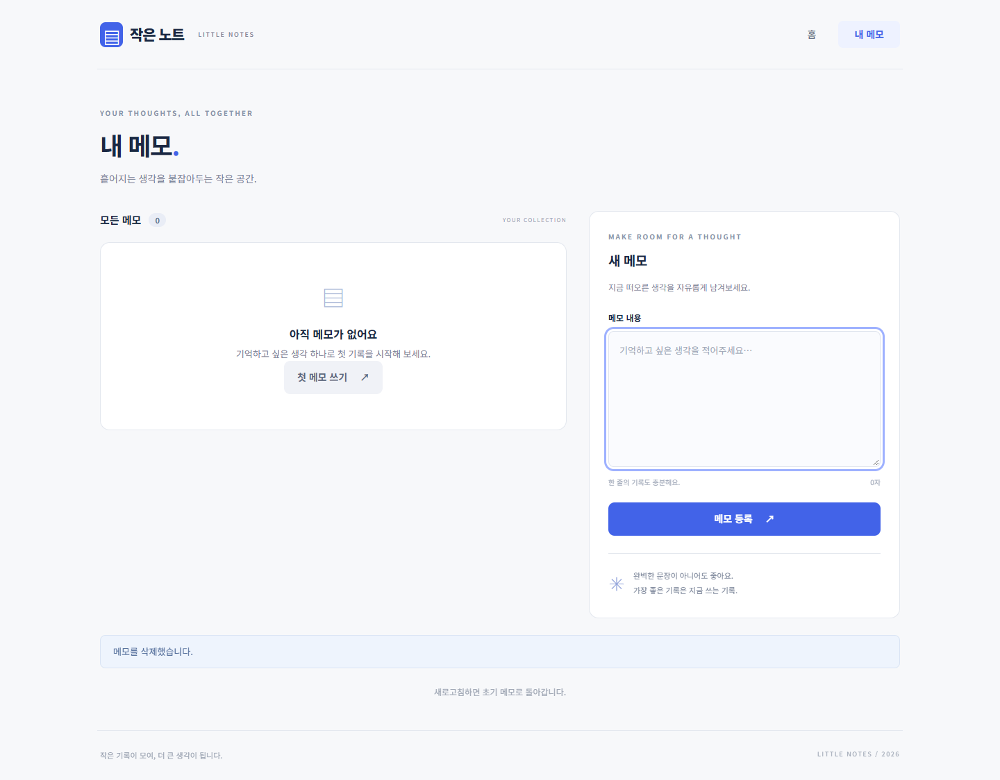

# GitHub Flow 실제 작업 기록

저장소: https://github.com/RockCandy444/next-notes-collaboration

PC 한 대와 GitHub 계정 하나에서 `git-practice-minsu`, `git-practice-jiyun`을 별도로 clone했습니다.
두 폴더의 origin은 위의 동일 저장소입니다. 역할을 파일과 작업 폴더로 구분했습니다.
실제 명령·출력은 [evidence/git-commands.txt](evidence/git-commands.txt)에 수록합니다.
원본 PR의 base·작업 브랜치·커밋·변경 파일·Merged 상태는 GitHub와 이 로그에서 함께 확인할 수 있습니다.

## 필수 PR 세 개

| PR | base ← 작업 브랜치 | 작업 및 직접 검토 |
| --- | --- | --- |
| [#1](https://github.com/RockCandy444/next-notes-collaboration/pull/1) | main ← feature/minsu | minsu.md 추가. PR 생성 뒤 동일 브랜치 보완 커밋을 push하여 기존 PR에 반영. Files changed에서 ID·취소 검증 계획까지 확인. |
| [#2](https://github.com/RockCandy444/next-notes-collaboration/pull/2) | main ← feature/jiyun | jiyun.md만 추가되는 diff 직접 확인. |
| [#3](https://github.com/RockCandy444/next-notes-collaboration/pull/3) | main ← feature/checklist | 지윤 폴더 최신 main에서 새 브랜치를 만들어 CHECKLIST.md 추가. 앞선 병합·양쪽 pull을 점검. |

모두 `gh pr merge URL --merge`를 사용하여 **Create a merge commit**으로 병합했습니다.
별도 계정과 자기 PR의 Approve 없이 변경 내용을 직접 읽은 결과를 각 PR 본문에 적었습니다.

### 브랜치 전환과 로컬 merge

민수 폴더: `main → feature/minsu`에서 파일 작성·커밋 → `main`에서 파일이 없는 것을 `git ls-files`로 확인 → `git merge feature/minsu` 실행 → `feature/minsu`로 복귀하여 push·PR.

지윤 폴더: `main → feature/jiyun`에서 다른 파일 작성·커밋 → `main`에서 지윤 파일이 없는 것을 확인 → `git merge feature/jiyun` 실행 → `feature/jiyun`으로 복귀하여 push·PR.

각 로컬 merge는 **작업 브랜치 → 그 폴더의 main** 방향이며 처음에는 Fast-forward였습니다.
로컬 main은 push하지 않았으므로 GitHub main은 PR 병합으로만 변경을 받았습니다.

### GitHub 병합 뒤 두 폴더 pull

PR #1·#2 병합 뒤 양쪽에서 `git switch main`, `git pull --no-rebase origin main`을 실행했습니다.
두 폴더의 `git ls-files`에 **minsu.md·jiyun.md가 모두 있음**을 확인했습니다.
PR #3 병합 뒤 다시 양쪽 pull을 실행하여 CHECKLIST.md를 받았습니다.
민수는 `git branch -d feature/minsu`, 지윤은 `git branch -d feature/jiyun feature/checklist`를 실행했습니다.
양쪽 `git branch` 출력이 main만 표시되는 것도 기록했습니다.

## 선택 1: 같은 줄 충돌 해결

| PR | 작업 |
| --- | --- |
| [#4](https://github.com/RockCandy444/next-notes-collaboration/pull/4) | 민수 feature/title-minsu: README 공동 작업 제목을 `메모 앱 기능 점검`으로 수정·검토·먼저 병합 |
| [#5](https://github.com/RockCandy444/next-notes-collaboration/pull/5) | 지윤 feature/title-jiyun: 같은 줄을 `Git 브랜치 협업 점검`으로 수정한 PR. 최신 main merge로 실제 충돌을 만들고 같은 PR에서 해결 |

지윤 작업 브랜치에서 `git fetch origin main`, `git merge origin/main`을 실행했습니다.
실제 출력은 `CONFLICT (content): Merge conflict in README.md`, `UU README.md`였습니다.
최종 제목은 **메모 앱 기능과 Git 브랜치 협업 점검**입니다.
과제의 두 목표가 모두 필요하므로 양쪽 의도를 합쳐 남겼으며 충돌 마커를 제거했습니다.
해결 내용을 add·commit·push하여 새 PR 대신 기존 #5에 반영했습니다.
최종 diff를 다시 읽고 merge commit으로 병합한 뒤 양쪽 main에서 pull했습니다.
각자의 완료한 제목 작업 브랜치도 `git branch -d`로 정리했습니다.

## 선택 2: Next.js 실제 변경의 새 PR

앱의 기본 구현 `3b9b33c`를 main에 올린 뒤 최신 main을 pull하고 새 `codex/notes-empty-guide` 브랜치를 만들었습니다.
**[PR #6](https://github.com/RockCandy444/next-notes-collaboration/pull/6)**의 base는 main입니다.

실제 앱 변경 파일: `next-practice/components/Notes.js`.
빈 목록의 문구를 구체적으로 바꾸고 `첫 메모 쓰기` 버튼을 추가하여 작성 textarea에 포커스를 이동하게 했습니다.
`next-practice/tests/state.spec.js`에는 빈 목록 버튼 클릭과 입력 포커스 확인을 추가했습니다.
앱 동작 변경과 검증 자료만 추가되는 Files changed를 직접 읽어 PR 본문에 결과를 적었습니다.

lint·build 성공 뒤 start로 실행한 앱의 state 브라우저 테스트 3개 통과를 [state-guide-tests.txt](evidence/state-guide-tests.txt)에 기록했습니다.
PR #6을 merge commit으로 병합한 뒤 `main`으로 전환하고 `git pull --ff-only`로 결과를 받았습니다.
root의 완료한 작업 브랜치를 삭제했으며 민수·지윤 두 폴더에서도 main을 pull했습니다.
앞의 필수 PR 및 충돌 PR과 동일하게 실제 명령·출력·PR 메타데이터가 git-commands.txt에 있습니다.

## 제출 상태

필수 PR #1·#2·#3, 충돌 실습 #4·#5, 앱 개선 #6을 모두 merge commit으로 병합했습니다.
전체 소스, 실제 출력과 검증 결과를 동일 저장소 main에서 확인할 수 있습니다.
강의실의 제출 버튼은 누르지 않았습니다. 사용자 승인을 받아 Public으로 전환했으며 GitHub의 `isPrivate: false`, 기본 브랜치 main을 확인했습니다.

## 질문 답변

**main에서 git merge feature/minsu를 실행하면 어느 브랜치가 변경을 받는가?**

현재 체크아웃한 main이 feature/minsu의 변경을 받습니다. feature/minsu가 main의 변경을 받는 명령이 아닙니다.

**GitHub에서 PR을 병합한 뒤에도 각 폴더에서 pull해야 하는 이유는 무엇인가?**

PR 병합은 GitHub의 원격 main을 변경하며 각 clone의 로컬 main을 자동으로 갱신하지 않습니다.
각 폴더에서 pull해야 다른 사람의 변경과 원격 merge commit을 받아 다음 작업을 최신 main에서 시작할 수 있습니다.
