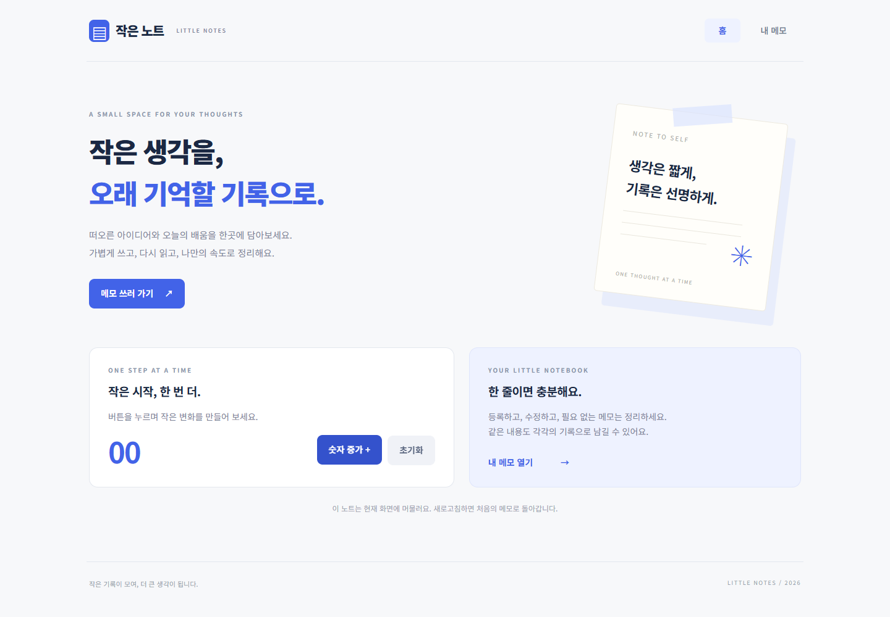

# Next.js 메모 앱과 Git 브랜치 협업

수업 [과제 50](https://classroom.codemit.kr/classes/5/problems/50/submit)의 **필수 20개·선택 4개**를 구현했습니다.
두 clone의 실제 PR 협업, state 기반 메모 앱, 기존 Flask·PostgreSQL API에 연결한 Next.js 화면을 포함합니다.
강의실에는 제출하지 않았습니다.

| 결과물 | 위치 | 실행 주소 |
| --- | --- | --- |
| 필수: state 메모 앱 | `next-practice` | http://127.0.0.1:3000 |
| 선택: DB 메모·감시 화면 | `mini-watch/monitor/next-frontend` | http://127.0.0.1:5173/notes |
| 기존 Flask API | `mini-watch/monitor/backend` | http://127.0.0.1:5200/health |
| 기존 게시판 | `mini-watch/general` | http://127.0.0.1:5100 |



## 설치·실행: 필수 메모 앱

Node.js 22.12 이상과 npm, Git을 준비합니다. 프로젝트는 공식 create-next-app의 JavaScript·App Router로 생성했습니다.
아래 명령은 Windows PowerShell에서 실행합니다.

```powershell
git clone https://github.com/RockCandy444/next-notes-collaboration.git
cd next-notes-collaboration/next-practice
npm ci
npm run dev
```

브라우저에서 http://localhost:3000 을 열어 숫자 증가·초기화를 확인하고 `내 메모` 링크로 이동합니다.
기본 메모 2개, 등록·수정·취소·삭제 확인·공백 안내·빈 목록을 제공합니다.
같은 내용도 UUID로 구별합니다. **이 앱의 새로고침 후 초기 메모 복귀는 정상 동작**입니다.

개발 서버를 Ctrl+C로 종료한 뒤 프로덕션 실행:

```powershell
npm run lint
npm run build
npm run start
```

## Next.js·React와 각 파일의 역할

React는 UI 컴포넌트와 state를 다루는 라이브러리이며 Next.js는 React 위에 파일 기반 라우팅·서버 렌더링·빌드 등을 제공하는 프레임워크입니다.

| 파일 | 역할 |
| --- | --- |
| `app/layout.js` | 여러 페이지에 공유하는 헤더·내비게이션·푸터, html·body와 children |
| `app/page.js` | `/` 홈 화면과 Counter 연결 |
| `app/notes/page.js` | `/notes` 메모 화면과 Notes 연결 |
| `components/Counter.js` | useState 숫자 증가·초기화 |
| `components/Notes.js` | useState 입력값·메모 배열·편집 ID, map·ID key, 등록·수정·삭제 |
| `components/Navigation.js` | Link와 usePathname으로 현재 메뉴 표시 |

Counter와 Notes에는 `"use client"`를 붙였습니다. useState와 클릭·입력 이벤트, 브라우저의 confirm·UUID 기능이 필요하기 때문입니다.
Navigation도 현재 브라우저 경로를 사용하는 Client Component입니다.
page와 layout은 기본 Server Component로 구성하고 상호작용 부분을 Client Component로 연결합니다.

state 앱은 메모를 컴포넌트 메모리에만 저장하며 새 문서를 로드하면 초기 state로 다시 만들어집니다.
DB 앱은 POST·PUT·DELETE를 Flask에 보내 PostgreSQL에 저장하고 다시 GET으로 조회하므로 새로고침이나 서버 재실행 후에도 내용이 남습니다.

## 설치·실행: 선택 Flask·PostgreSQL 메모

Python 3.11 이상과 PostgreSQL 16 이상이 추가로 필요합니다. 아래 작업은 저장소 루트에서 시작합니다.
기존 DB가 있다면 그대로 이어 사용하며, `.env`와 테이블 데이터를 덮어쓰지 않습니다.

### 1. DB와 API 준비

처음 사용하는 환경에서만 두 DB를 생성합니다. 기존 DB가 있으면 없는 DB만 SQL에서 생성하세요.

```powershell
cd mini-watch
psql -h 127.0.0.1 -U postgres -d postgres -f setup/create_databases.sql
python -m venv .venv
.\.venv\Scripts\python.exe -m pip install -r monitor/backend/requirements.txt -r general/requirements.txt
```

`psql`이 PATH에 없으면 PostgreSQL 설치 경로의 psql.exe를 사용합니다.

실제 `.env`가 없는 경우에만 예시를 복사하고 본인 설정으로 편집합니다.

```powershell
Copy-Item monitor/backend/.env.example monitor/backend/.env
Copy-Item general/.env.example general/.env
```

DB_HOST·DB_PORT·DB_NAME·DB_USER·DB_PASSWORD를 지정합니다. 감시는 monitor_db, 게시판은 general_db입니다.
감시 `.env`의 SECRET_KEY는 다음 명령으로 만든 값을 설정하며 FRONTEND_ORIGIN은 http://127.0.0.1:5173 입니다.

```powershell
.\.venv\Scripts\python.exe -c "import secrets; print(secrets.token_hex(32))"
.\.venv\Scripts\python.exe monitor/backend/prepare_db.py
Push-Location general
..\.venv\Scripts\python.exe prepare_db.py
Pop-Location
```

DB 준비 SQL은 IF NOT EXISTS를 사용하여 기존 메모·계정·게시글을 보존합니다.

### 2. 각 서비스를 별도 터미널에서 실행

모두 `mini-watch` 폴더에서 시작합니다.

```powershell
# 터미널 1: 감시 API
.\.venv\Scripts\python.exe monitor/backend/app.py
```

```powershell
# 터미널 2: 선택 사항, 기존 게시판·요청 기록 수집
Push-Location general
..\.venv\Scripts\python.exe app.py
```

```powershell
# 터미널 3: Next.js DB 메모 화면
cd monitor/next-frontend
npm ci
npm run dev
```

http://127.0.0.1:5173/register 에서 감시 운영자 계정을 만들거나 기존 감시 계정으로 로그인합니다.
http://127.0.0.1:5173/notes 에서 메모 목록·상세·등록·수정·삭제를 확인합니다.
수정·삭제 취소는 DB를 바꾸지 않으며 공백은 400, 없는 ID는 404로 오류를 안내합니다.

Next.js의 `/api` rewrite는 Flask 5200으로 전달합니다. 프론트엔드에 DB 비밀번호를 넣지 않습니다.
API 주소를 바꾸려면 `.env.example`을 참고해 **빌드 전** `MONITOR_API_URL`을 설정하세요.
서버 주소는 rewrite 빌드 설정에 반영되므로 변경 후 다시 build 합니다.
개발 종료 후 `npm run build`, `npm run start`로 동일한 DB 화면을 실행할 수 있습니다.

## 시작 자료와 직접 수정한 부분

- 필수 앱: 공식 [create-next-app](https://nextjs.org/docs/app/getting-started/installation) 생성 후 기본 화면을 실제 실행했습니다.
- 심화 시작 자료: 수업 [mini-watch](https://github.com/zeroskill2400/mini-watch)와 이전 [mini-watch-crud](https://github.com/RockCandy444/mini-watch-crud)의 `mini-watch-day04` 결과물을 이어 사용했습니다.
- 직접 구현: 필수 홈·공통 레이아웃·숫자 버튼·메모 CRUD와 반응형 디자인.
- 직접 연결: `monitor/next-frontend`의 `/notes` 페이지·Link 메뉴·Flask 프록시 환경 설정과 입력 label.
- 직접 검증: 두 clone의 실제 PR·충돌 해결·브랜치 정리, PostgreSQL 임시 스키마 브라우저 검사, 동작·빌드 로그.

## 검사 재현과 결과

2026-10-08 실제 검사에서 **브라우저 5개, PostgreSQL 통합 20개 통과**, 두 앱의 `npm run build`와 필수 앱 lint가 성공했습니다.
[VERIFICATION.md](VERIFICATION.md)에 동작 순서와 실제 출력, 화면 캡처를 정리했습니다.

state 앱을 127.0.0.1:3000에서 실행한 뒤 `next-practice`에서:

```powershell
npx playwright test tests/state.spec.js
```

기본 테스트는 설치된 Edge의 별도 테스트 프로필을 사용합니다.
DB 브라우저 검사는 기존 자료를 보존하는 임시 스키마 서버를 사용합니다.
`mini-watch`에서 `.env` DB 준비 후:

```powershell
# 터미널 A
.\.venv\Scripts\python.exe verification_server.py
```

```powershell
# 터미널 B: next-frontend에서, 기존 dev/start는 먼저 종료
$env:MONITOR_API_URL='http://127.0.0.1:5201'
npm run dev
```

```powershell
# 터미널 C: next-practice에서
$env:TEST_DATABASE_UI='1'
npx playwright test
```

검증 서버를 Ctrl+C로 종료하면 자기 임시 스키마만 제거합니다. fixture의 비밀번호는 테스트 전용이며 운영 계정으로 사용하지 않습니다.
Python 통합 검사도 기존 데이터를 건드리지 않는 임시 스키마를 사용합니다.

```powershell
# mini-watch에서
.\.venv\Scripts\python.exe -m unittest discover -s monitor/backend/tests -v
Push-Location general
..\.venv\Scripts\python.exe -m unittest discover -s tests -v
Pop-Location
```

런타임 의존성 npm audit 결과 취약점 0개였습니다. 공식 생성 도구의 ESLint 개발 의존성은 braces 전이 의존성 경고 5개를 보고하며 확인 시 패치 버전은 제공되지 않았습니다.

## 제출 자료

제출할 GitHub 주소: **https://github.com/RockCandy444/next-notes-collaboration**

README, [GIT_WORK.md](GIT_WORK.md), [VERIFICATION.md](VERIFICATION.md), `evidence`의 실제 로그·캡처와 두 앱의 소스·package-lock.json을 함께 제공합니다.
실제 .env·DB 비밀번호·인증 토큰·node_modules·.next·가상환경·캐시는 Git에서 제외했습니다.
저장소가 비공개라면 채점 전에 강사가 원본 PR과 소스를 읽을 수 있는 공개 또는 접근 설정이 필요합니다.

## 협업 실습

같은 main에서 작업 브랜치를 만들고 PR의 변경 파일을 직접 검토한 뒤 merge commit으로 병합했습니다.
각 폴더의 main은 GitHub 병합 뒤 pull했습니다. 전체 명령과 실제 출력은 GIT_WORK.md를 참고하세요.

## 공동 작업 제목

메모 앱 기능과 Git 브랜치 협업 점검
