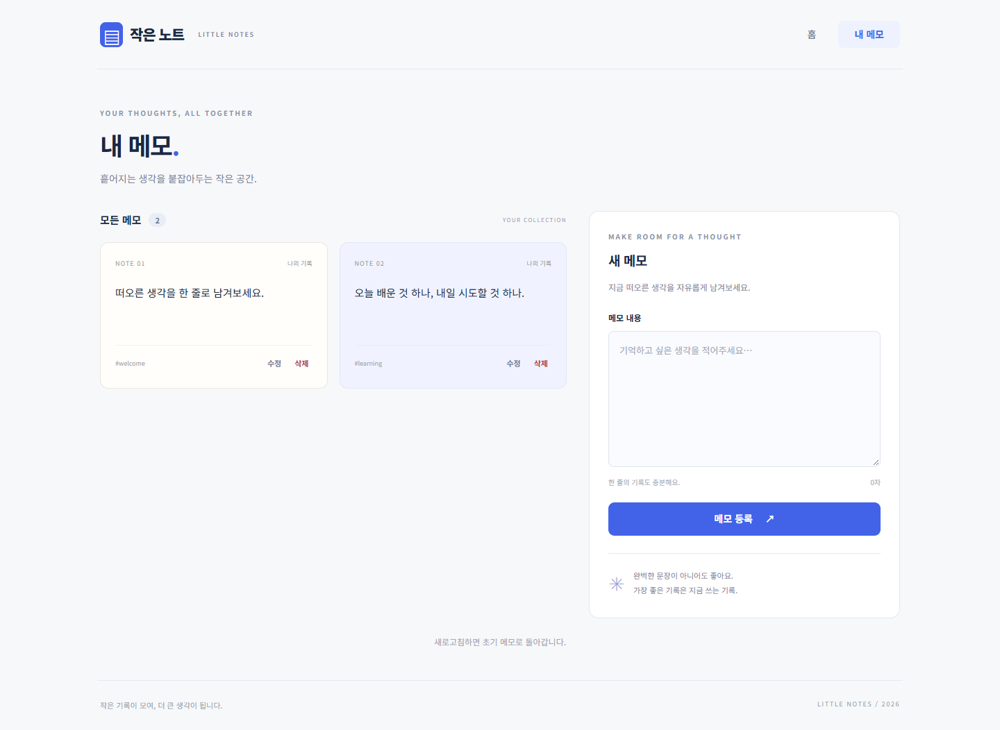
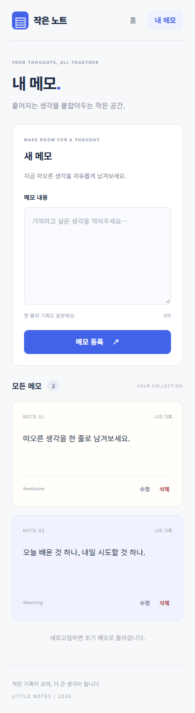
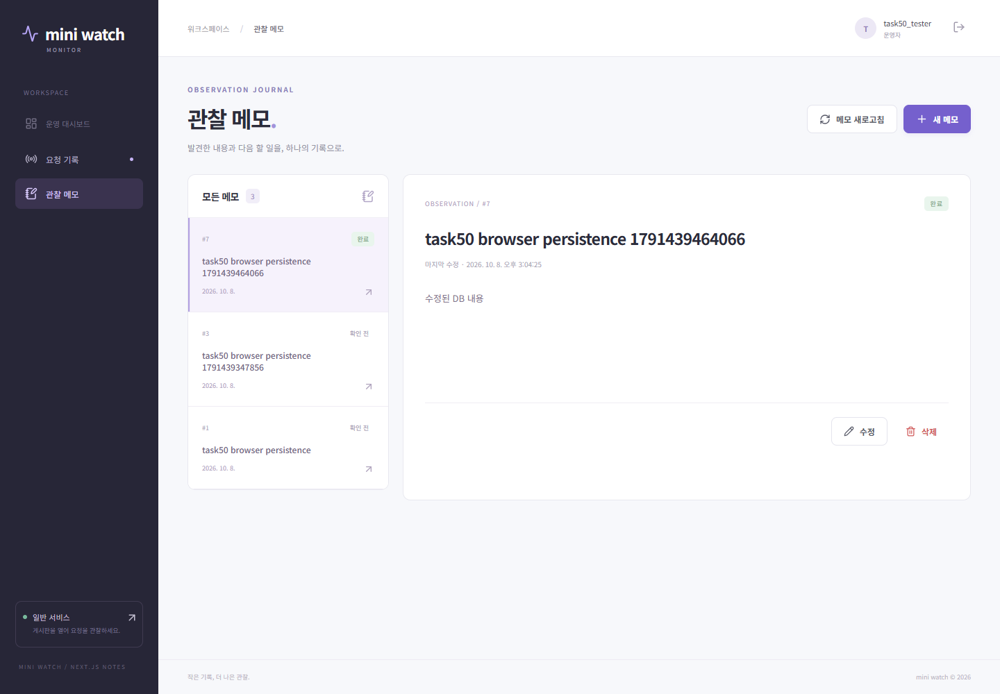

# 실제 동작 확인 결과

확인 날짜: 2026-10-08 (Asia/Seoul). 강의실 제출은 실행하지 않았습니다.

## 공식 프로젝트 생성과 실행

```text
npx --yes create-next-app@16.4.0 next-practice --js --eslint --no-tailwind --app --no-src-dir --import-alias @/* --use-npm --disable-git --yes
Creating a new Next.js app ... next-practice.
Using npm.
Initializing project with template: app
Success! Created next-practice ...
```

생성 직후 `npm run dev -- --hostname 127.0.0.1 --port 3000`으로 실행했습니다.
브라우저에서 Create Next App 제목과 `To get started, edit the page.js file.` 기본 화면을 확인한 뒤 수업 요구사항을 적용했습니다.
최종 Next.js 16.4.0, React 19.3.0, Node.js v24.21.0, npm 11.19.0을 사용했습니다.

## 필수 state 앱

`tests/state.spec.js`에서 아래 내용을 실제 Edge 브라우저로 검증했습니다.

- 홈 숫자 00 → 01 → 02 → 초기화 00, Link로 `/notes` 이동.
- 등록에 공백만 입력하면 안내를 표시하고 목록 2개 유지.
- 같은 내용 두 개를 등록한 뒤 서로 다른 UUID 확인.
- 한 메모를 수정 취소하면 원래 내용 유지. 공백 수정은 안내·기존 내용 유지.
- 한쪽만 수정 저장하며 다른 UUID의 메모는 그대로 유지.
- 삭제 취소는 4개 유지. 수정 중인 메모를 삭제하면 목록 3개, 입력 빈 값, 등록 모드로 복귀.
- 모든 메모 삭제 후 빈 목록 안내. 새로고침 후 초기 메모 2개 복원.
- 모바일 390×844 화면에 가로 넘침 없음.





## 심화 Flask·PostgreSQL 앱

`mini-watch/verification_server.py`로 실제 PostgreSQL의 임시 스키마를 준비했습니다.
기존 사용자의 계정·메모·게시글은 수정하지 않고, 테스트 계정과 메모는 그 스키마에만 저장했습니다.
테스트 전용 API 5201과 Next.js 프록시 5173을 연결했습니다. 일반 실행은 API 5200을 사용합니다.

`tests/database.spec.js`에서 아래 흐름을 확인했습니다.

- 로그인 → `/notes` 목록 → POST 등록 → 상세 GET → 새로고침 후 목록·상세 재조회.
- 기존 제목·본문 표시 → 수정 취소 → 원래 데이터 유지.
- 공백 본문 PUT은 실제 HTTP 400, 오류 안내, 성공 문구 없음, 상세 API의 기존 body 보존.
- 본문·상태 수정 → 새로고침 → 수정된 본문과 DB 조회 확인.
- 삭제 대화상자 취소 → 메모 보존, 확인 → DELETE 성공 → 새로고침 후 목록에서 제거.
- 삭제한 ID에 GET·PUT·DELETE를 요청하면 모두 404.
- 다른 API 요청으로 편집 중인 메모를 지운 뒤 저장하면 404 안내와 입력값 유지, 저장 성공 안내 없음.
- 이미 없는 메모의 삭제 확인도 404를 안내하며 대화상자를 유지하고 삭제 성공 안내를 표시하지 않음.



## 개발 서버 종료 후 프로덕션 검증

두 개발 서버를 Ctrl+C로 종료한 뒤 각각 `npm run build`를 실행하여 성공했습니다.
그다음 `npm run start`로 실행한 결과물에서 전체 브라우저 테스트 **5개 통과**를 확인했습니다.

| 검사 | 결과 | 실제 출력 |
| --- | --- | --- |
| 필수 앱 ESLint | 통과 | [state-lint.txt](evidence/state-lint.txt) |
| 필수 앱 build | 성공, `/`·`/notes` 생성 | [state-build.txt](evidence/state-build.txt) |
| 심화 앱 build | 성공, `/`·`/notes`·회원가입 경로 생성 | [database-build.txt](evidence/database-build.txt) |
| build → start 브라우저 테스트 | 5 passed | [production-browser-tests.txt](evidence/production-browser-tests.txt) |
| PR #6 빈 목록 안내 개선 후 state 프로덕션 검사 | 3 passed | [state-guide-tests.txt](evidence/state-guide-tests.txt) |
| 감시 API PostgreSQL 통합 검사 | 8 tests, OK | [monitor-tests.txt](evidence/monitor-tests.txt) |
| 기존 게시판 PostgreSQL 통합 검사 | 12 tests, OK | [general-tests.txt](evidence/general-tests.txt) |

테스트의 DB 연결 오류·400·404는 의도한 실패 조건을 검사합니다. 성공 응답과 구분하여 화면에 오류가 표시되는지 확인했습니다.
두 Python 통합 검사는 임시 스키마를 검사 뒤 정리합니다. 브라우저 검증 서버도 Ctrl+C 종료 시 자기 임시 스키마만 정리합니다.
이번 도구 실행은 프로세스 종료 후 테스트 스키마가 남아 있어, 정확한 스키마 이름과 테스트 전용 계정만 있는 것을 확인한 뒤 해당 스키마만 제거했습니다. 제거 후 조회 결과가 없는 것을 확인했으며 기존 사용자 자료는 보존했습니다.

## 직접 수정과 시작 자료

- 필수 앱은 공식 create-next-app 생성 소스에서 홈·공통 화면·메모·Counter·CSS를 직접 구현했습니다.
- DB 심화는 이전 `mini-watch-day04`의 Flask·PostgreSQL API와 React 컴포넌트를 이어 사용했습니다.
- 이번 결과물의 `monitor/next-frontend`에 Next.js App Router `/notes`를 추가하고 메뉴를 Link로 연결했습니다.
- Next.js 프록시 API 주소를 서버 환경 변수로 설정하게 했고 편집 폼의 label과 입력 ID를 명시적으로 연결했습니다.
- 기존 요청 기록, 로그인·회원가입, 메모 상태, PUT·DELETE API와 SQL은 유지했습니다.
- 재현 가능한 브라우저 검사와 임시 PostgreSQL 검증 서버를 추가했습니다.
- PR #6에서 빈 목록의 첫 메모 쓰기 버튼과 작성 칸 포커스 이동을 추가하고 프로덕션 검사 3개를 다시 통과했습니다.
